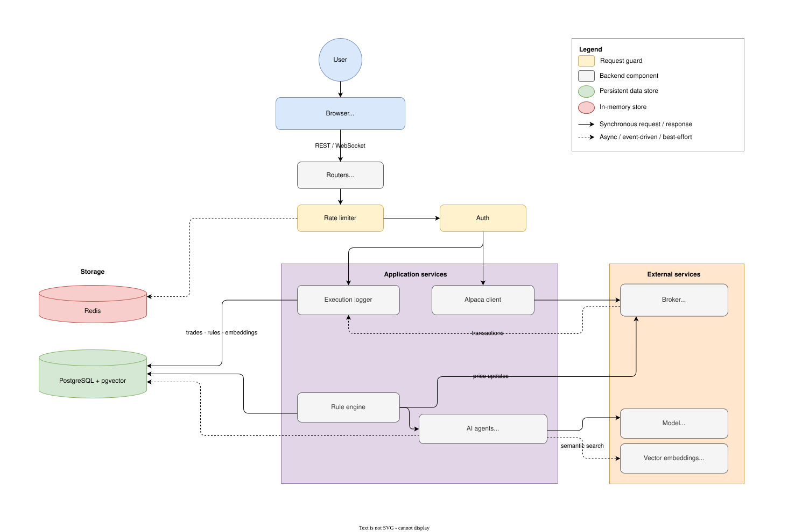

# Erwix: Multi-Agent Trading System

A TradingView-style charting + paper-trading terminal backed by Alpaca, with
automatic logging of every execution, an AI analyst that narrates trade windows
and annotates the chart, a deterministic rule-watch engine for live alerts, and
RAG-backed semantic search over trade history.

## Stack

- **Frontend:** Next.js (static export) + TypeScript + Tailwind, `lightweight-charts` deployed to Cloudflare Pages
- **Backend:** Python + FastAPI, `alpaca-py` (market data + paper trading) deployed on AWS Lightsail behind a Cloudflare Tunnel
- **Auth:** local username/password (argon2id + JWT, httpOnly cookies)
- **AI agents:** LangGraph state graphs calling AI model
- **Embeddings:** Voyage AI (`voyage-3.5-lite`) into pgvector for RAG over trade history
- **DB / cache:** PostgreSQL + pgvector, Redis (rate limiting)

## Architecture



## Setup

### 1. Database

```bash
docker compose up -d            # postgres + pgvector on :5432
```

### 2. Backend

```bash
cd backend
cp ../.env.example .env
python -m venv .venv && source .venv/Scripts/activate
pip install -e ".[dev]"
alembic upgrade head
uvicorn app.main:app --reload   # http://localhost:8000/docs
```

Get free paper-trading keys at <https://alpaca.markets>.

### 3. Frontend

```bash
cd frontend
npm install
npm run dev                     # http://localhost:3000
```

## Features

**Charting and paper trading**
- Live candlestick charts, fed by Alpaca's historical and streaming data
- Place market or limit orders, buy or sell, against a paper account
- See open positions and account balance at a glance
- Every fill gets logged automatically, no manual entry
- Trade journal you can filter by day, week, month, or all time

**AI trade analyst**
- Ask Model to review a stretch of trades against your stated strategy
- It draws directly on the chart, arrows and circles marking entries and exits
- Chat with it about your history; it can pull up any past trade to answer
- Trade notes are searchable by meaning, not just keyword, so "that breakout I chased too late" actually finds something
- Backtest a strategy against historical data, and browse a library of saved strategies
- News feed with AI-written sentiment takes

**Live monitoring** (in progress)
- Price rules run against every live quote in plain code, no AI in the loop, so alerts fire instantly
- Model only gets called in when a stop-loss or take-profit line actually gets crossed, to explain what happened
- Link your own Alpaca account instead of using the shared one
- Guided onboarding walks new users through a sample scenario

## Tests

```bash
cd backend && pytest
```
