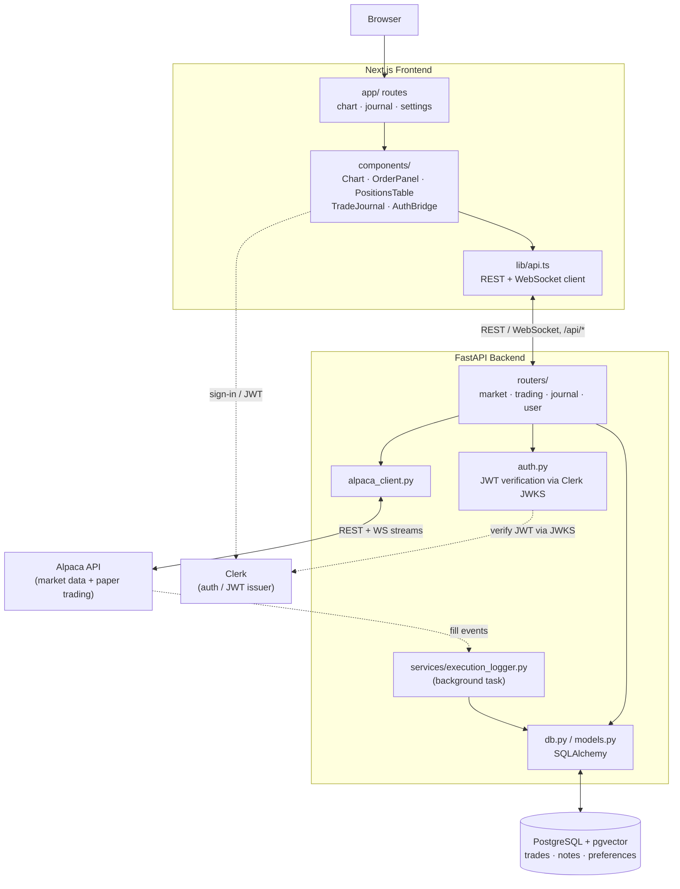

# Entro — Multi-Agent Trading System

A TradingView-style charting + paper-trading terminal backed by Alpaca, with
automatic logging of every execution. Architected so an AI analyst layer
(reviewing trades against your strategy, drawing marked-up chart snippets, with
RAG over past activity) drops in as Phase 2 without rework.

## Stack

- **Frontend:** Next.js + TypeScript + Tailwind, `lightweight-charts` (TradingView's library)
- **Backend:** Python + FastAPI, `alpaca-py` (data + paper trading)
- **DB:** PostgreSQL + pgvector (Docker)

## Architecture



## Setup

### 1. Database

```bash
docker compose up -d        # postgres + pgvector on :5432
```

### 2. Backend

```bash
cd backend
cp ../.env.example .env      # then fill in ALPACA_API_KEY / ALPACA_SECRET_KEY
python -m venv .venv && source .venv/Scripts/activate   # Windows Git Bash
pip install -e ".[dev]"
alembic upgrade head        # create tables + enable pgvector
uvicorn app.main:app --reload   # http://localhost:8000/docs
```

Get free paper-trading keys at <https://alpaca.markets>.

### 3. Frontend

```bash
cd frontend
npm install
npm run dev                 # http://localhost:3000
```

## Features (Phase 1)

- Real-time candlestick charts (Alpaca historical + live bar WebSocket)
- Paper order placement (market / limit, buy / sell)
- Positions + account summary
- **Automatic trade logging** — every fill is persisted to the `trades` table
- Trade journal with date-window filter (1D / 7D / 30D / All)

## Phase 2 (designed for, not yet built)

- Analyst agent (`claude-opus-4-8`) reviews a trade window vs. your strategy
- Chart annotations (arrows / circles / entry-exit markers) emitted as JSON and
  drawn on the live chart — see `ChartAnnotation` in `frontend/lib/api.ts`
- RAG over past trades/events using pgvector (already enabled)

## Tests

```bash
cd backend && pytest
```
